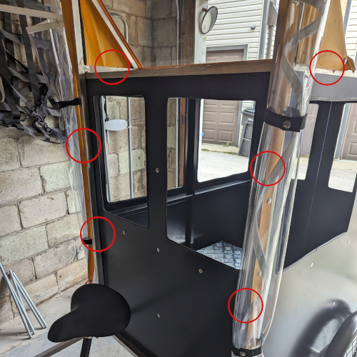
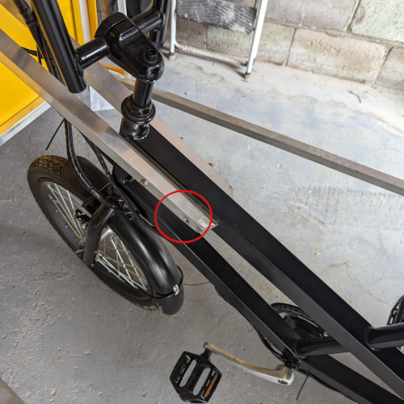
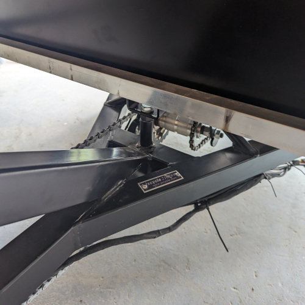
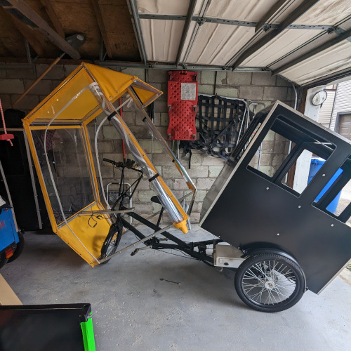
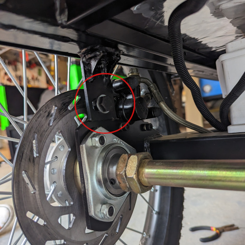
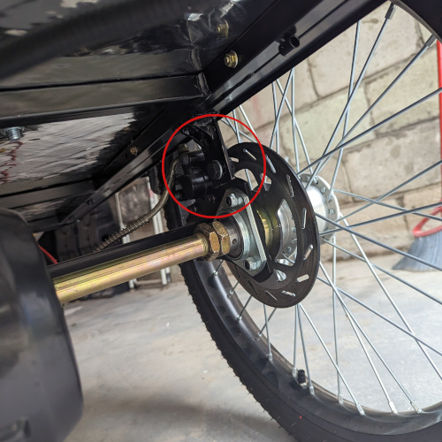
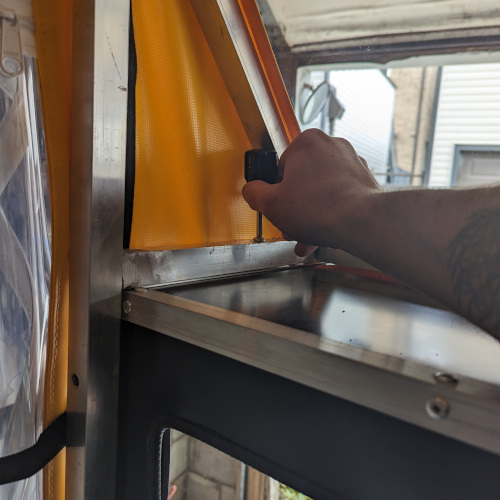
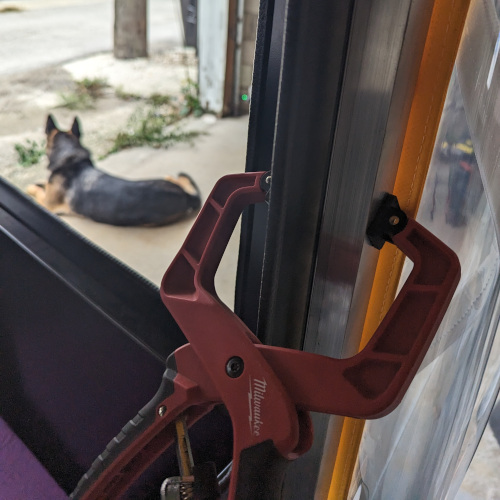

The A133, a vehicle renowned for its reliability and performance, has a control box that the user rarely needs to access, but when they do, it might seem tricky at first glance. However, with the right set of instructions, “popping the hood” on the A133 can be a straightforward process. Follow these step-by-step instructions to successfully access the engine compartment for maintenance or inspection.

## Prerequisites

Before you begin, make sure you have the following tools and materials ready:

* 17mm ratchet wrench
* Short Phillips head screwdriver
* 7/16 wrench or socket
* Assistant or a clamp (optional but helpful)
* Safety goggles and gloves (for added protection)

## Steps to Pop the Hood

### Step 1: Locate and Remove the Front Body Bolts

1. Start by identifying the six bolts that connect the front body to the rear body. These bolts are typically located around the perimeter of the front body.
1. Using the appropriate tool, carefully remove all six bolts. It's crucial to keep track of these bolts as they will be needed for reattachment.

### Step 2: Remove the Rear Bolt Connecting the Front Body to the Frame

1. Next, locate the two bolts that connect the front body to the frame. These bolts are positioned at the rear end of the front body.
1. Remove the **rear** bolt, leaving the front bolt in place.

### Step 3: Remove the Bolt Connecting the Rear Body to the Frame

1. Now, identify the bolt that connects the rear body to the frame. This bolt is typically located near the rear of the vehicle.
1. Carefully remove this bolt..

### Step 4: Pivot the Front and Rear Body Upwards

1. With all the necessary bolts removed, gently pivot the front and rear body upwards together. This will allow you to access the engine compartment beneath.

## Reattachment Tips
When reattaching the front and rear body or performing maintenance tasks, consider the following helpful tips:

* If the front bolt for attaching the rear body doesn't line up during reattachment, try loosening the two rear bolts slightly. Be cautious during this step, as it can be easy to pinch your fingers.
  
      
* When removing the top two bolts that connect the front and rear body, a short Phillips head screwdriver may be helpful due to limited space.
    
* Having an assistant can be very helpful when reconnecting the front and rear body.
  
* For removing and reinstalling the front bolt that attaches the rear body to the frame, a 17mm ratchet wrench is most helpful.
  
Following these instructions carefully will enable you to safely and effectively pop the hood on your A133, providing access to the motor controller for any necessary maintenance or inspections. Always exercise caution when working on your vehicle to ensure your safety and the proper functioning of your A133.

