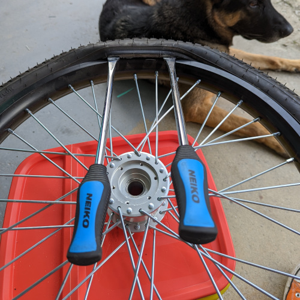
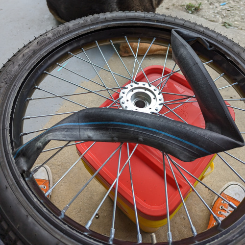
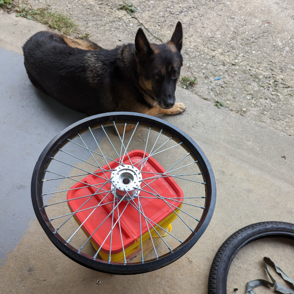
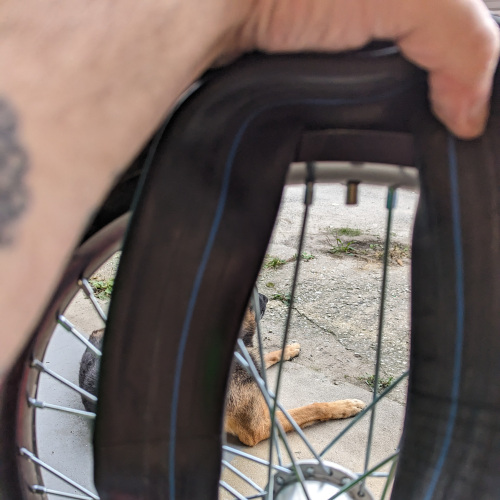
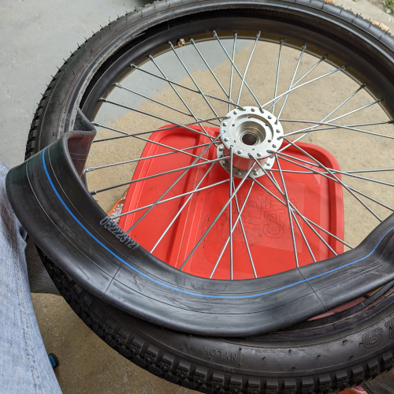
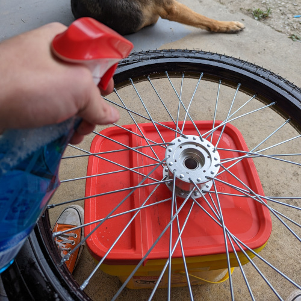
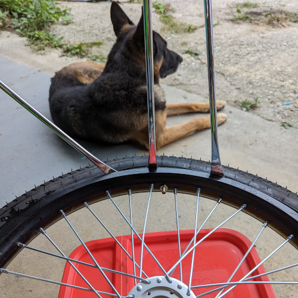
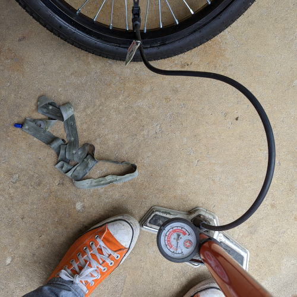

## Introduction:
If you own an A133 with rear wheels that resemble a hybrid between a dirt bike and a mountain bike, you may have encountered the need to replace the inner tube. While many resources are available on platforms like YouTube (**which we highly recommend watching in addition to this guide**) for changing dirt bike tires and inner tubes, this guide will provide a concise overview of the process. Here, we'll outline the essential tools required and the steps to successfully replace the inner tube on your A133.

## Tools Required:
Before you begin, make sure you have the following tools on hand:

1. 24mm lug wrench 
1. Jack stand
1. 3 tire spoons
1. 12mm wrench
1. Tire lube or Windex (optional but highly encouraged)
1. A bucket or other stand (optional but highly encouraged)

## Parts Required:
You will also need the following parts:

1. 70/100-19 inner tube (preferably heavy-duty)
1. 19-inch rim strip

## Steps:
Now, let's dive into the steps to replace the inner tube on your A133:

### Step 1: Secure the Vehicle
Start by locking the rear brakes and loosening the lug nut. Lift the frame  
slightly and place a jack stand underneath. Continue loosening the lug nut 
and  remove the wheel.

### Step 2: Prepare the Wheel
Place the wheel on a bucket or another stand. It doesn't matter which side 
is  facing up at this point.

### Step 3: Remove the Bead
Using the tire spoons, carefully begin to remove the bead from the rim. Take 
your time to ensure it comes off smoothly.

### Step 4: Remove the Inner Tube
Once the bead is completely removed, use the 12mm wrench to remove the nuts 
on the valve stem. Then, carefully remove the old inner tube from the tire.

### Step 5: Finish Removing the Tire
Continue removing the tire from the rim, making sure to be gentle and avoid  
damaging the rim.

### Step 6: Replace the Rim Strip
Before installing the new inner tube, replace the rim strip to ensure a secure fit.

### Step 7: Set the Bead
Place one side of the tire bead back onto the rim. This will create a space for 
the new inner tube.

### Step 8: Insert the New Inner Tube
Open the new inner tube and insert the valve stem through the hole in the 
rim.  Thumb-tighten the valve stem into place.

### Step 9: Seat the Inner Tube
Carefully push the new inner tube into the tire, ensuring that it lies flat 
and evenly inside. Be vigilant not to let the tube twist or kink during this 
process.

### Step 10: Install the Other Bead
Work the bead on the other side of the wheel back into place. Be cautious 
not  to extend the tire spoons past 90 degrees with the wheel to avoid  
"pinching" the new tube.

### Step 11: Inspect the Wheel
After installing both beads, inspect the wheel on both sides to ensure that 
the bead is entirely seated.

### Step 12: Inflate the Tire
Pump the tire up to around 20 psi and reinspect the bead. If everything 
looks secure and properly seated, continue to pump up the tire to your 
desired pressure.

### Conclusion:
Replacing the inner tube on your A133 rear wheel is a manageable task with the right tools and a careful approach. Be patient and pay close attention to detail to ensure a successful replacement. If you're new to this process, consider watching instructional videos to gain a better understanding before attempting it yourself. With the right tools and a bit of know-how, you can keep your A133 rolling smoothly.
