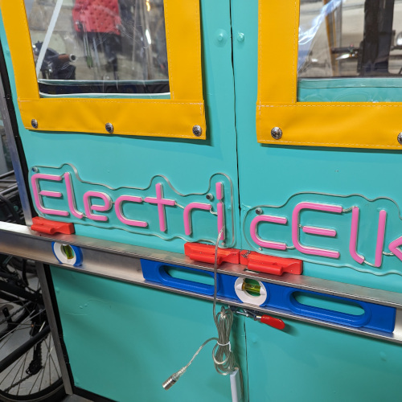

# How to Install Rear Light Badges on the A133 (All Models)

## Introduction
Enhance the appearance and visibility of your A133 vehicle by installing rear light badges. This step-by-step guide will help you install these badges on both the A133-c and saloon models. Be sure to gather all the required tools and parts before starting the installation.

**Tools Required:**
- Drill and drill bits
- JRready crimper
- Wire stripper
- Large level
- Sharpie
- Extra person OR magnetic vinyl wrap holders

**Parts Required:**
- Badge (1 for A133-c, 2 for saloon)
- Nuts, washers, and bolts for attaching badges AND/OR appropriately sized sheet metal screws
- JRready 3-pin connectors (1 for A133-c, 2 for saloon)
- Dual-intensity brake light driver (1 for A133-c, 2 for saloon)

*Note: Photos show the installation on the saloon model.*

## Steps:

**Step 0: Preparing the Badge**
Before starting the installation, establish and mark which wire on the badge is positive and which is negative through a bench test.

**Step 1: Designate Placement**
Using a large level, designate the placement of the badges on your vehicle. Mark the holes to be drilled.

**Step 2: Drill Holes**
Drill holes in the marked locations based on the badge's mounting holes. Additionally, drill one hole for the wire to be run through the door. Be sure to drill the wire pass-through hole on the sheet metal, not on the frame.

**Step 3: Attach Badges and Run Wires**
Attach the badges to the drilled holes and run the wire through the access hole. If the drill hole is in the frame, use a sheet metal screw. If it's on a sheet metal panel, use bolts, washers, and nuts for secure attachment.

**Step 4: Pass Wires to Floorboard**
Drill a hole in the floorboard to pass the wires through. This will allow you to connect them to your vehicle's brake lights.

**Step 5: Splice Wiring**
Splice the wiring as follows:
- White: Neutral
- Black with white stripe: Brake lights
- Blue: Running lights
- Red with white stripe / Yellow: Turn signals

Use JRready connectors to splice into all wires except the turn signals. Ensure that you maintain the circuits driving the tail lights.

**Step 6: Connect to Dual-Intensity Brake Light Driver**
When connecting the wires to the dual-intensity brake light driver, do not use the trigger negative (yellow) lead.

**Step 7: Test and Verify**
Before finishing the installation, test the badges to ensure they come on dimly with the running lamps and intensely with the brakes. Also, check that your other tail lights and turn signals are still functional.

Congratulations! You've successfully installed rear light badges on your A133, improving both its appearance and safety on the road. Enjoy your newly enhanced vehicle!
