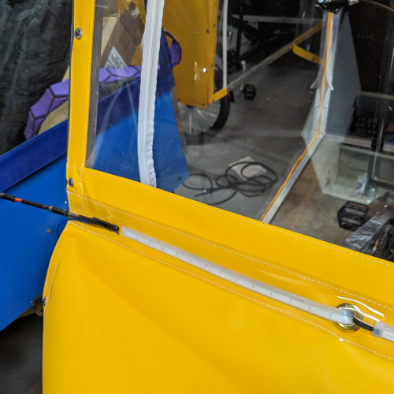

## Introduction

Installing LED running lamp/turn signal strips with JReady connectors is a 
straightforward process that can enhance the visibility and safety of your 
A133. This guide will walk you through the steps required to complete this 
installation. Ensure you have all the necessary parts and tools before starting.

### Parts Required:

- JReady 4 pin connectors
- 4 strands of different colored 16 gauge wire, 80 inches each
- 18-inch LED running lamp/turn signal strips
- Electrical tape or conduit for wrapping the new wiring harness
- Zip ties

### Tools Required:

- JReady crimpers
- Wire strippers
- Needle nose pliers (optional)

## Installation Steps:

1. **Locate the JReady Pigtail:**
    - Identify the JReady pigtail coming out of the control box.
   
2. **Create a Matching Pigtail:**
    - To match the existing pigtail, note that the colors correspond to the following functions:
        - White -> ground
        - Blue -> running lights
        - Yellow -> right turn signal
        - Red with white stripe -> left turn signal
   
3. **Wrap the Wire Harness:**
    - Wrap the entire wire harness in electrical tape or conduit to protect and secure the wires.
  
4. **Connect the Wire Harness:**
    - Connect the wire harness to the pigtail coming from the control box.
    - Use zip ties to secure the harness to existing wiring to prevent it from dangling or getting caught.
5. **Insert Running Lights:**
    - Insert the LED running lights through the grommet into the clear pouch where they are mounted.
  
6. **Match the Wiring:**
    - Refer to the running lights' instructions to determine the correct wiring for the LED strips.
    - Create a pigtail that matches the one on the wire harness to connect to the LED strips.
    - Note: in the picture I am testing the wiring _before_ creating the 
      pigtail. 
   
7. *Test the Installation:**
    - Before finalizing the installation, test the LED running lamp/turn signal strips to ensure they operate correctly.
  

## Tips:

- Removing the end caps from the running lights can make it easier to thread them through the grommet.
- If you have difficulty pulling the running lights through the grommet, consider using needle nose pliers to aid in the process.
  
- A long dowel may also be helpful for 'threading' the running lights 
  through the sleeve.
   

By following these steps, you can successfully install LED running lamp/turn signal strips with JReady connectors on your vehicle, improving its visibility and safety.
