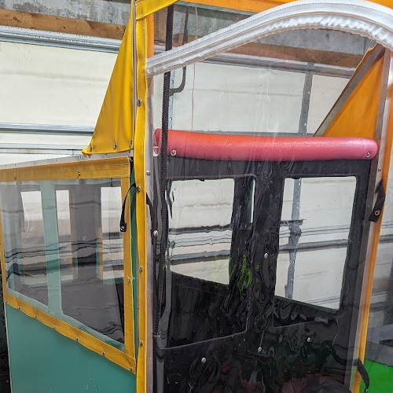
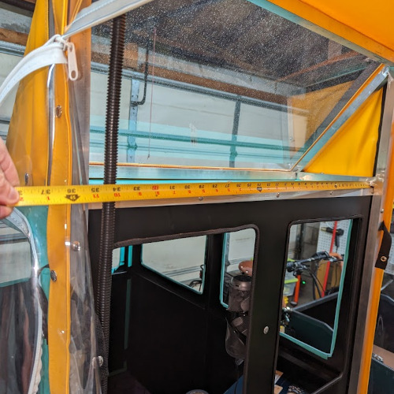
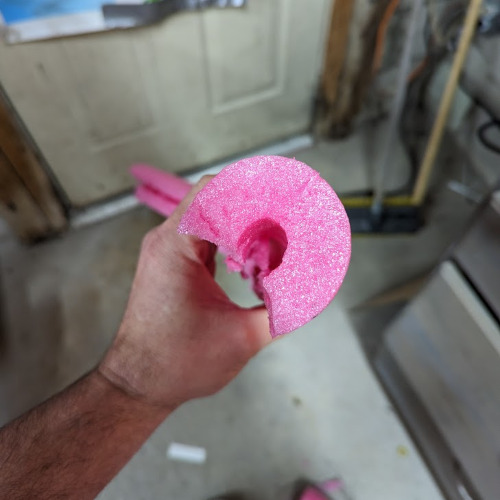
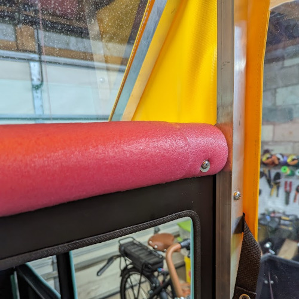

How to Add Padding to the Box Top of an A133 Saloon

If you own an A133 Saloon and find the top edge of the saloon's box uncomfortably close to your head, especially if you don't regularly wear a helmet, you may want to consider adding padding. This simple DIY project can help protect you in the event of a rear-end collision. Here's a step-by-step guide on how to add padding to the box top of your A133 Saloon.

Materials Required:

- Foam noodle (e.g., a pool noodle)
- Two sheet metal screws
- Two appropriately sized washers
- Weather stripping glue (optional)

Tools Required:

- Scissors
- Tape measure
- Drill and bit for driving screws

Instructions:

1. Measure the Bar
   

Start by measuring the length of the bar on the top edge of your A133 Saloon's box. Use a tape measure to get an accurate measurement.

2. Cut the Noodle

Take the foam noodle and cut it to the same length as the bar you measured in step 1.
Additionally, cut a quarter of the circle away from the foam noodle. This will allow it to fit snugly over the bar without obstructing any view or functionality.

3. Attach the Noodle

Position the foam noodle over the bar, making sure it covers the top edge completely.
Use the two sheet metal screws to secure the foam noodle to the bar. Place the screws at each end of the noodle.
To ensure a secure and long-lasting attachment, you can also apply weather stripping glue to the inside of the noodle before attaching it to the bar. This step is optional but can provide additional stability.

4. Secure with Washers

Place the appropriately sized washers over the screw heads on the inside of the noodle.
Tighten the screws until the noodle is securely fastened to the bar. Make sure it is in a position where it will effectively protect your head in case of a collision.

5. Test and Adjust

   After securing the foam noodle, carefully test the fit and make sure it provides adequate padding.
   Adjust the position if needed to ensure it covers the top edge of the box completely and is comfortable for you.

That's it! You've successfully added padding to the box top of your A133 Saloon, making it safer and more comfortable for passengers. This simple DIY project can provide peace of mind when traveling without a helmet and help protect you in the event of an accident.
