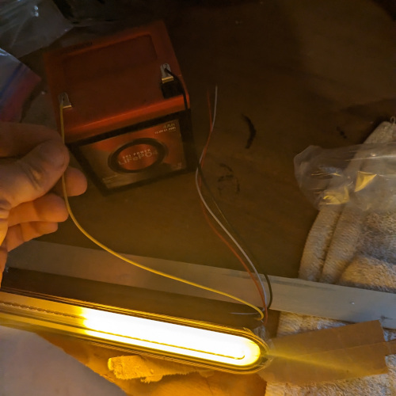
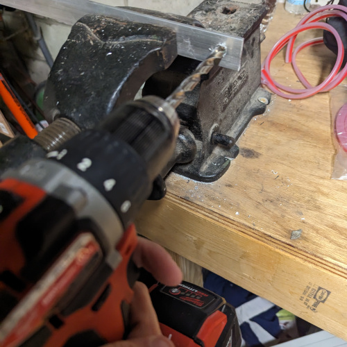
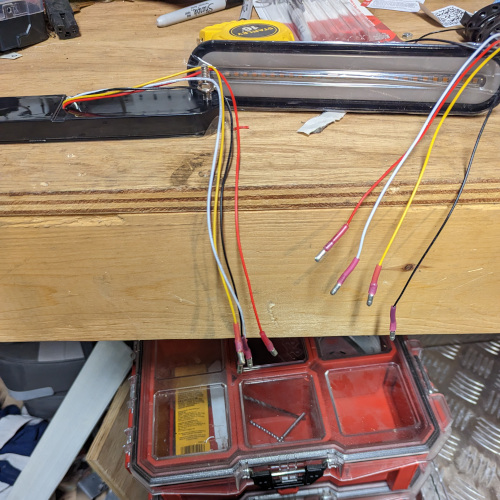
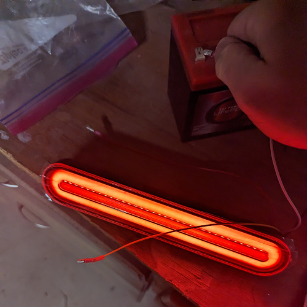
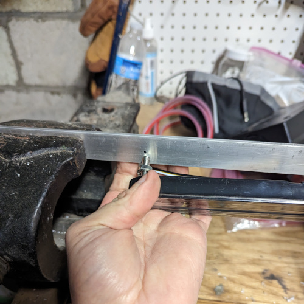
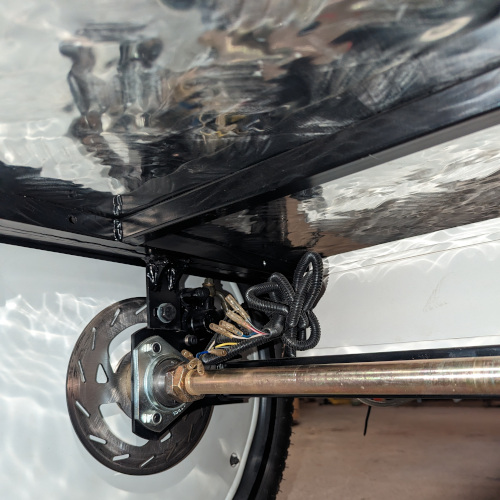
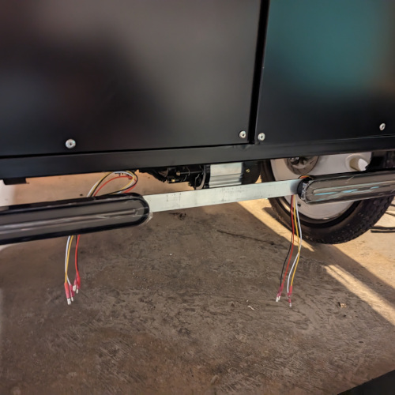
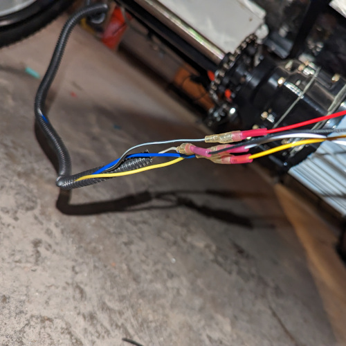
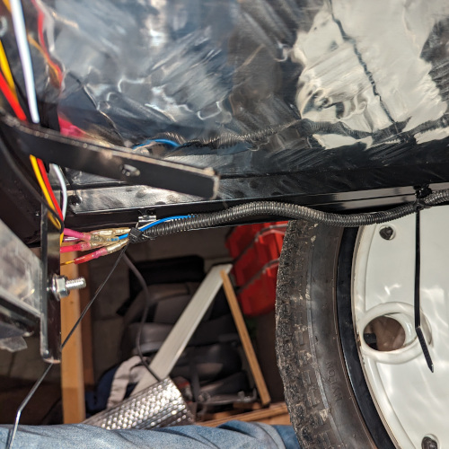
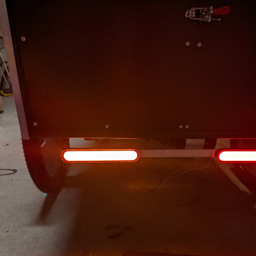

If you're looking to upgrade or replace the tail lights on your trike, this step-by-step guide will walk you through the process. To get started, you'll need a few tools and parts. Let's dive in!

## Tools Required:

- Wire strippers and crimpers (plus a heat gun if using water-resistant connectors)
- Wrenches and other basic tools
- Drill with appropriate bits
- Bench for testing (optional)

## Parts Required:

- New tail lamps
- Small 12v battery for bench testing (optional)
- 28.5-inch piece of Aluminum Flat bar (may not be needed if using other tail lamps)
- Bullet connectors (for plugging new tail lamps into existing wires)
- Mounting hardware (depends on tail lamps being used)

## Installation Steps:

**Step 1: Bench Test the New Tail Lights**
Before installing your new tail lights, it's a good idea to bench test them to ensure they're working correctly. Pay close attention to the turning indicator to make sure it's clear which way it operates.

**Step 2: Drill Mounting Holes**
Drill mounting holes in the flat bar to secure the tail lamps. Ensure that the flat bar can also be securely mounted to your trike.

**Step 3: Attach Bullet Connectors**
Attach bullet connectors to the wires on the tail lamps. Note that we strongly recommend using water-resistant connectors. You'll need a heat gun to activate the water resistance feature.

**Step 4: Bench Test Again**
After attaching the connectors, bench test the lights once more to ensure that all connectors are properly installed.

**Step 5: Attach Lights to the Flat Bar**
Securely attach the tail lights to the flat bar. The specific method may vary depending on the tail lights you're using.

**Step 6: Run Signal Wires**
If you are replacing existing tail lights, the signal wires should be near the tail lights. If you are installing tail lights for the first time, locate the signal wires by the control box. Run them to their respective tail lights. Ensure that the wires won't interfere with other moving parts and securely fasten them.

**Step 7: Wiring the Tail Lights**
For both left and right tail lights, here's a general guide to the wire colors:
- Solid white wire: Ground
- Black wire with a white stripe: Brake light
- Solid blue wire: Running lights
- Solid yellow or red wire with a white stripe: Turn signal

Consult the documentation that comes with your tail lamps for precise wiring instructions.

With these steps, you should be well on your way to successfully installing new tail lights on your trike. Make sure to follow safety precautions and double-check your connections before hitting the road. Happy riding!

